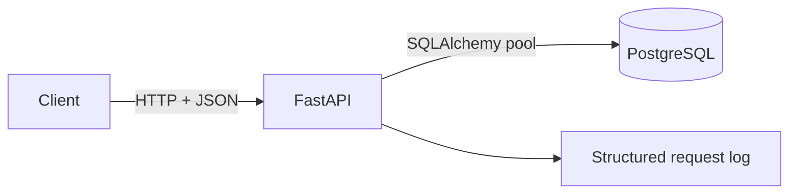
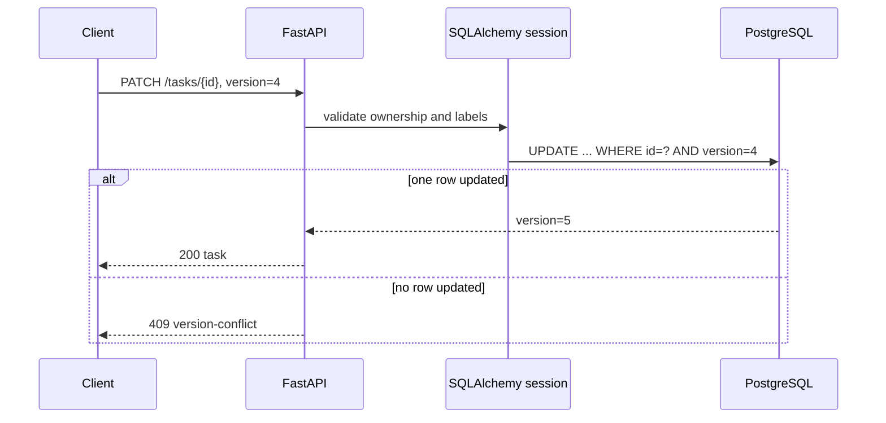

# 01. Personal Task API

> Status: **complete reference project**

A REST service for users, projects, labels, and tasks. It is intentionally one
service and one PostgreSQL database: the lessons are HTTP contracts, relational
modeling, query behavior, and concurrency—not distributed infrastructure.

## Architecture



## Run it

```bash
docker compose up --build
```

Then open:

- Swagger UI: <http://localhost:8000/docs>
- OpenAPI JSON: <http://localhost:8000/openapi.json>
- Readiness: <http://localhost:8000/health/ready>

Reset the local database with `docker compose down -v`.

## Try it

Create the ownership chain:

```bash
curl -X POST http://localhost:8000/api/v1/users \
  -H "Content-Type: application/json" \
  -d '{"email":"learner@example.com","display_name":"System Learner"}'
```

Use the returned user ID to create a project, then create labels and tasks
through `/docs`. Fetch tasks with either:

```text
GET /api/v1/tasks?limit=20&offset=0
GET /api/v1/tasks?limit=20&cursor=<next_cursor>
```

Update a task with its current version:

```json
{
  "version": 1,
  "status": "in_progress"
}
```

Repeating that update with version `1` returns `409` instead of silently
overwriting version `2`.

## Test it

Fast local acceptance suite:

```bash
python -m pip install -e ".[dev]"
pytest
```

PostgreSQL integration run:

```bash
docker compose -f docker-compose.test.yml up --build --abort-on-container-exit
```

## Break it

1. Send two PATCH requests with the same task version; one must receive `409`.
2. Use one user's label on another user's project; the API must receive `422`.
3. Stop PostgreSQL; readiness must receive `503`.
4. Seed data and run `experiments/query-plans.sql` to see the indexed and
   unindexed execution plans.
5. Run `experiments/pagination_benchmark.py` with shallow and deep offsets.

## Request flow



The detailed decisions and experiments live in `docs/`.

