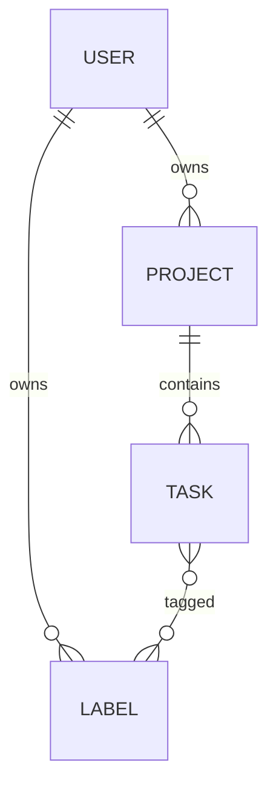

# System design

## Why one service

The data is relational and the baseline workload fits one database. Splitting
users, projects, and tasks would add network failures and cross-service
transactions without teaching anything the current requirements need.

## Data model



Uniqueness is enforced by the database for user email, project name per owner,
and label name per owner. The task status and version have check constraints.

## API contract

All resources live below `/api/v1`. OpenAPI at `/docs` is the executable
contract. Validation failures, conflicts, and missing resources share the same
problem response. Task PATCH and DELETE require the version observed by the
client.

## Pagination

Offset pagination supports jumping to an arbitrary page and is easy to explain,
but PostgreSQL must walk past earlier rows. Cursor pagination uses the stable
ordering `(created_at DESC, id DESC)` and a matching composite index. The UUID
is the deterministic tie-breaker when timestamps match.

## Concurrency

Task updates are a single statement:

```sql
UPDATE tasks
SET ..., version = version + 1
WHERE id = :id AND version = :expected_version
RETURNING id;
```

Zero rows means the task disappeared or another writer won. The API distinguishes
`404` from `409`; it never performs a read-then-write race.

## Connection pool

The API defaults to five persistent database connections with ten overflow
connections. `pool_pre_ping` removes broken connections before use. Tune only
after comparing API concurrency with PostgreSQL's connection budget.

## Scaling path

1. Add read replicas only when measured read throughput saturates the primary.
2. Add Redis only when repeated reads dominate and stale reads are acceptable.
3. Partition only after indexes and retention policies no longer keep the
   working set manageable.

