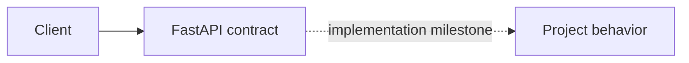

# 03. Distributed Rate Limiter

> Status: **planned contract shell** — the learning specification and service
> boundary are runnable; domain behavior is implemented in roadmap order.

Atomic per-user, IP, and API-key limits enforced before application work.

## How it works



The baseline deliberately starts with the fewest components that can expose
the design question. Infrastructure is added only when an experiment proves
the need.

## Try it

```bash
docker compose up --build
curl http://localhost:8000/health/ready
curl -i http://localhost:8000/api/v1/planned
```

The second request returns a typed 501 application/problem+json response so
consumers can integrate against the common service contract without mistaking
this milestone for a finished implementation.

## Break it

Race hundreds of clients for the final token; compare fixed-window and token-bucket burst behavior.

## Learning target

Token buckets, Redis Lua, distributed coordination, fail-open and fail-closed policy.

See docs/system-design.md for the implementation boundary and sequence.