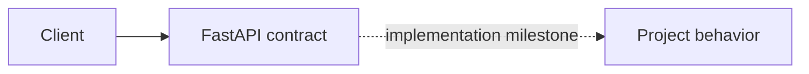

# 05. Background Job System

> Status: **planned contract shell** — the learning specification and service
> boundary are runnable; domain behavior is implemented in roadmap order.

At-least-once jobs with retries, idempotent workers, and a dead-letter path.

## How it works



The baseline deliberately starts with the fewest components that can expose
the design question. Infrastructure is added only when an experiment proves
the need.

## Try it

```bash
docker compose up --build
curl http://localhost:8000/health/ready
curl -i http://localhost:8000/api/v1/planned
```

The second request returns a typed 501 application/problem+json response so
consumers can integrate against the common service contract without mistaking
this milestone for a finished implementation.

## Break it

Kill a worker mid-job; duplicate a message; fail a job five times; restart Redpanda.

## Learning target

Queues, delivery guarantees, backoff, idempotency, job state machines, worker concurrency.

See docs/system-design.md for the implementation boundary and sequence.