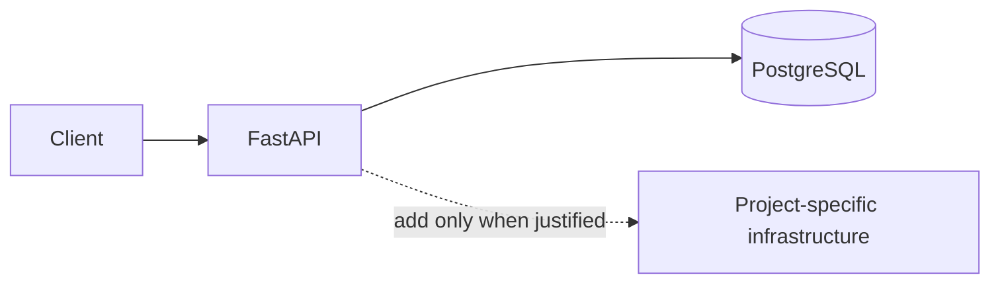

# System design

## Goal

The same search contract backed first by PostgreSQL and then OpenSearch.

## Baseline architecture

Target topology: **PostgreSQL → indexing worker → OpenSearch; Search API → selected backend**.

## Contracts

- HTTP errors use pplication/problem+json.
- Every request receives an X-Request-ID.
- Health probes are /health/live and /health/ready.
- Events use a versioned envelope with event ID, type, timestamp, producer,
  schema version, idempotency key, and payload.

## Implementation milestones

1. Define the domain schema and executable contracts.
2. Implement the single-node correctness baseline.
3. Add the project-specific infrastructure.
4. Run the scale and failure experiments.
5. Publish measured results and the scaling decision.

## Decision boundary

No distributed component is accepted without a measured limitation in the
previous milestone.