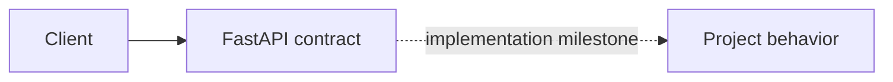

# 11. Order and Payment Saga

> Status: **planned contract shell** — the learning specification and service
> boundary are runnable; domain behavior is implemented in roadmap order.

Checkout across inventory, payment, order, and shipping without a distributed transaction.

## How it works



The baseline deliberately starts with the fewest components that can expose
the design question. Infrastructure is added only when an experiment proves
the need.

## Try it

```bash
docker compose up --build
curl http://localhost:8000/health/ready
curl -i http://localhost:8000/api/v1/planned
```

The second request returns a typed 501 application/problem+json response so
consumers can integrate against the common service contract without mistaking
this milestone for a finished implementation.

## Break it

Fail every saga step in turn; replay events; stop a relay after committing its outbox row.

## Learning target

Sagas, transactional outbox, compensations, idempotent payments, state machines.

See docs/system-design.md for the implementation boundary and sequence.